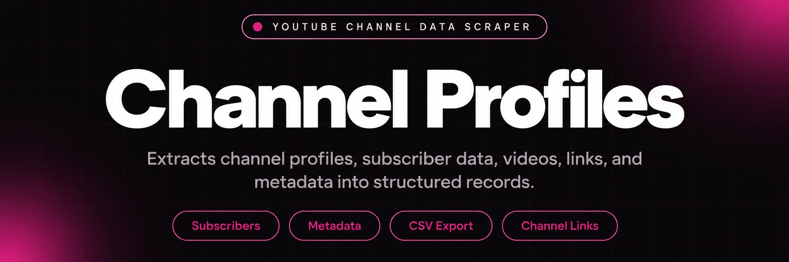
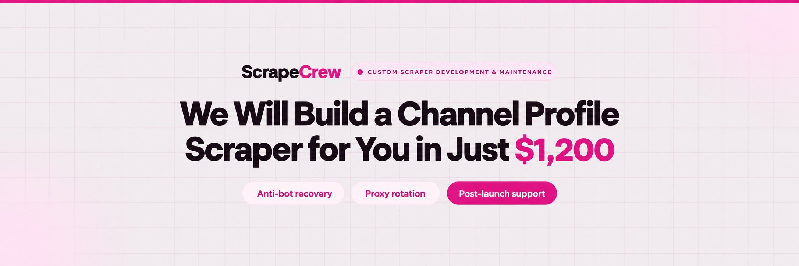
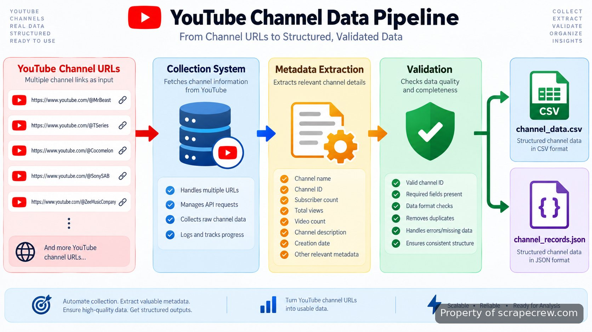

<p align="center">
  <a href="https://www.scrapecrew.com/scraper/youtube-scraper-comment-analysis" target="_blank" rel="nofollow">
    
  </a>
</p>

## ScrapeCrew's youtube channel scraper

ScrapeCrew's youtube channel scraper is built for collecting structured channel-level information when a research process depends on more than a list of links. The system turns channel URLs or discovery inputs into records containing subscriber counts, publishing patterns, descriptions, links, verification status, and other public metadata. It is designed for teams that need consistent channel records rather than manually opening hundreds of pages and copying fields one by one.

> A channel data collection system built around repeatable fields, exports, and research workflows.

The build uses YouTube's public data interfaces where available, including the <a href="https://developers.google.com/youtube/v3" target="_blank" rel="nofollow">YouTube Data API documentation</a>, and combines that access pattern with extraction logic for channel research workflows. The output is structured so it can move into spreadsheets, databases, CRM systems, or internal research tools without additional cleanup.

<a href="https://www.scrapecrew.com/scraper/youtube-scraper-comment-analysis" target="_blank" rel="nofollow">
  
</a>

<p align="center">
  <a href="https://t.me/Bitbash333" target="_blank" rel="nofollow">
    
  </a>&nbsp;
  <a href="https://wa.me/923249868488?text=Hi%2C%20I%27m%20interested%20in%20ScrapeCrew." target="_blank" rel="nofollow">
    
  </a>&nbsp;
  <a href="mailto:hello@scrapecrew.com" target="_blank" rel="nofollow">
    
  </a>&nbsp;
  <a href="https://www.scrapecrew.com" target="_blank" rel="nofollow">
    
  </a>
</p>

## Channel Metadata Collection

The main problem in creator research is inconsistent information. A channel page may show useful details, but collecting the same fields across hundreds or thousands of channels manually creates missing values, formatting differences, and outdated lists. This system captures a defined channel metadata set so each record follows the same structure.

| Field | Captured Data |
| --- | --- |
| Channel identity | Channel name, URL, unique channel identifier, and public profile details. |
| Audience signals | Subscriber count and total channel views available from the source. |
| Publishing activity | Video count and upload frequency indicators derived from channel activity. |
| Profile information | Description, About section details, website links, and social references. |
| Trust indicators | Verification status and other visible channel attributes. |



## Creator Research Workflows

Channel-level data is useful when the research question is about who publishes content, how large their audience is, and how consistently they operate. The system focuses on those profile questions instead of collecting individual video discussions or comment-level analysis.

- Influencer vetting teams can compare creators using the same audience and activity fields before building partnerships or outreach lists.
- Agencies can create creator lead lists with profile details, links, and publishing indicators organized for prospecting workflows.
- Analysts can use market research datasets to compare channel categories, audience size, and publishing patterns over defined groups.
- Brands tracking competitors can monitor channel-level changes without manually reviewing every profile.

## Core Features

| Feature | Description |
| --- | --- |
| Bulk Channel Input | The manual problem of opening profiles individually is removed by accepting channel URL collections and processing them as a batch. |
| Structured Metadata Fields | The issue of inconsistent research notes is reduced by mapping each channel into predefined fields for names, counts, links, and descriptions. |
| Activity Tracking Fields | The difficulty of judging channel activity from a single visit is addressed with video counts and upload frequency data points. |
| Export Formatting | The need to reformat collected records before analysis is removed through prepared CSV export and structured data outputs. |
| Research Workflow Integration | The gap between collected profiles and internal systems is handled through formats that can be moved into Sheets, databases, or CRM processes. |

## ScrapeCrew's youtube channel scraper Setup and Run Process

The repository represents a completed working system. A typical run follows a defined input, collection, validation, and export path rather than requiring a developer to rebuild the extraction process.

- **STEP 1 — Download & Set Up the Project** Download and configure <a href="https://www.scrapecrew.com/scraper/youtube-scraper-comment-analysis" target="_blank" rel="nofollow">ScrapeCrew's youtube channel scraper</a> to access the prepared collection workflow.
- **STEP 2 — Add Channel Sources** Open the input interface and provide channel URLs or discovery parameters for the collection run.
- **STEP 3 — Select Export Fields** Choose required metadata fields and output settings before starting the extraction process.
- **STEP 4 — Run Collection** Start the job and receive structured channel records through CSV export or connected storage outputs.

<a href="https://tally.so/r/BzWjZQ?platform=GitHub&amp;format=Product+repo&amp;brand=ScrapeCrew&amp;niche=scraping&amp;page=YouTube+Channel+Scraper+using+YouTube+Data+API&amp;date=2026-09-11" target="_blank" rel="nofollow">
  
</a>

## Technical Implementation

The implementation separates source handling, data mapping, validation, and export layers so changes to one part of the workflow do not require rewriting the entire system. API-based requests follow the documented methods from <a href="https://developers.google.com/youtube" target="_blank" rel="nofollow">Google Developers YouTube resources</a>, while browser-based collection components use established automation patterns where required.

The processing layer validates returned values before export. For example, a channel record with a missing description remains identifiable as a missing field rather than shifting other columns and corrupting the dataset. Export files preserve field names so downstream analysis tools can consume the data consistently.

```text
youtube-channel-scraper/
├── src/
│   ├── collector.py
│   ├── channel_parser.py
│   ├── validators.py
│   └── exporter.py
├── config/
│   └── settings.json
├── data/
│   ├── channel_inputs.csv
│   └── channel_outputs.csv
├── requirements.txt
└── README.md
```

## Data Output and Integrations

A useful collection process ends with records that fit the next system. The export layer produces structured files for review and transfer, including CSV datasets that can be opened in spreadsheet tools and parsed by internal applications.

A sample output record can contain values such as a channel name, 245000 subscribers, 320 published videos, a channel description, website references, and publishing activity measurements. The exact values depend on the public channel data available during collection.

| Example Field | Example Value |
| --- | --- |
| Channel Name | Example Creator Network |
| Subscribers | 245000 |
| Video Count | 320 |
| Upload Frequency | Weekly publishing pattern |
| Export Format | CSV record |

## Extending Beyond Profile Data

Channel records answer questions about creators and publishing activity. When research requires viewer reactions, comment analysis, or video-level information, the broader <a href="https://www.scrapecrew.com/scraper/youtube-scraper-comment-analysis" target="_blank" rel="nofollow">YouTube scraper using YouTube Data API</a> covers those additional collection needs.

ScrapeCrew also handles custom scraper development and maintenance when an existing extraction workflow needs new fields, deployment changes, monitoring, or connections to an internal data stack.

## Operational Notes

Public platform data collection requires respecting platform rules, applicable regulations, and access limits. The system is designed around publicly available channel information and documented interfaces. It does not access private or unlisted channel data unless that information is already available through authorized access.

Performance depends on source availability, requested fields, and collection volume. Runs are structured to handle batches of records while maintaining validation checks before files are delivered.

## Project References

The implementation follows documented practices from the <a href="https://developers.google.com/youtube/v3/getting-started#quota" target="_blank" rel="nofollow">YouTube Data API quota guide</a>, <a href="https://developers.google.com/youtube/v3/docs/channels" target="_blank" rel="nofollow">YouTube channel resource reference</a>, and <a href="https://developers.google.com/sheets/api" target="_blank" rel="nofollow">Google Sheets API documentation</a> when spreadsheet delivery is required. Research workflows can also be evaluated against industry guidance such as <a href="https://www.iab.com/topics/creator-economy/" target="_blank" rel="nofollow">IAB creator economy resources</a> and <a href="https://datareportal.com/reports" target="_blank" rel="nofollow">DataReportal digital reports</a>.

## FAQ

### Does this collect complete channel profiles instead of only contact details?

Yes. The system collects channel-level profile information such as subscriber counts, video counts, descriptions, links, join details where available, and publishing indicators. Contact discovery is a separate workflow focused on finding available email information.

### Can it process many channel URLs in one run?

Yes. The workflow accepts channel collections and maps each source into the same structured fields. Batch size depends on source access limits and the selected collection configuration.

### Does it work with private or unlisted channels?

No. The system works with publicly available channel information or data available through authorized access. Private and unavailable channel data cannot be collected without permission.

### What format does the collected data use?

The primary export format is structured CSV data, with records organized around channel fields. The output can also be adapted for database or internal application workflows.

<table>
  <tr>
    <td align="center" width="33%">
      
      <p>This scraper helped me gather thousands of posts effortlessly. The setup was fast, and exports are super clean and well-structured.</p>
      <p><b>Nathan Pennington</b><br>Marketer<br>★★★★★</p>
    </td>
    <td align="center" width="33%">
      
      <p>What impressed me most was how accurate the extracted data is. Likes, comments, timestamps — everything aligns perfectly.</p>
      <p><b>Greg Jeffries</b><br>SEO Affiliate Expert<br>★★★★★</p>
    </td>
    <td align="center" width="33%">
      
      <p>It's by far the best tool I've used. Ideal for trend tracking, competitor monitoring, and influencer insights.</p>
      <p><b>Karan</b><br>Digital Strategist<br>★★★★★</p>
    </td>
  </tr>
</table>